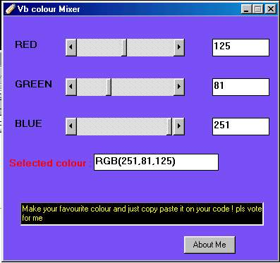



## vb color selector

### Description

This program consists of three scrollbar , which you can use to create colors, it also give the color codes and you can simply copy paset the colour code.
 
### More Info
 

             |
---                |---
**Submitted On**   |2006-05-02 10:52:34
**By**             |[Bibin Edmond](https://github.com/Planet-Source-Code/PSCIndex/blob/master/ByAuthor/bibin-edmond.md)
**Level**          |Intermediate
**User Rating**    |5.0 (15 globes from 3 users)
**Compatibility**  |VB 6\.0, ASP \(Active Server Pages\) 
**Category**       |[Graphics](https://github.com/Planet-Source-Code/PSCIndex/blob/master/ByCategory/graphics__1-46.md)
**World**          |[Visual Basic](https://github.com/Planet-Source-Code/PSCIndex/blob/master/ByWorld/visual-basic.md)
**Archive File**   |[vb\_color\_s199187532006\.zip](https://github.com/Planet-Source-Code/bibin-edmond-vb-color-selector__1-65210/archive/master.zip)

